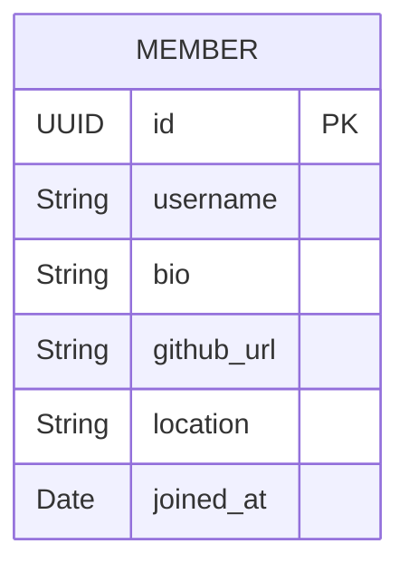

# 👤 Member Service

The Member Service handles all developer profile information, extended details, and community interactions.

## 🏗️ Architecture Flow

## 🔑 Key Responsibilities
- **Profile Management**: Updating bios, social links, and locations.
- **Developer Discovery**: Searching and filtering developers within the CoderRide community.
- **Data Isolation**: This service specifically handles *public* profile data, separated entirely from the sensitive authentication data stored in the Auth Service.

## ⚙️ Environment Variables
Required variables in `.env`:
- `MEMBER_DB_URL`
- `MEMBER_DB_USERNAME`
- `MEMBER_DB_PASSWORD`

## 🛠️ Tech Stack
- **Database**: PostgreSQL (`member_db`)
- **Port**: `8082`
